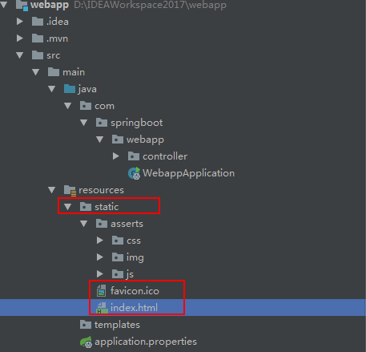

# SpringBootWeb开发

## 1.SpringBoot静态资源映射规则

~~~java
public void addResourceHandlers(ResourceHandlerRegistry registry) {
            if (!this.resourceProperties.isAddMappings()) {
                logger.debug("Default resource handling disabled");
            } else {
                Duration cachePeriod = this.resourceProperties.getCache().getPeriod();
                CacheControl cacheControl = this.resourceProperties.getCache().getCachecontrol().toHttpCacheControl();
                if (!registry.hasMappingForPattern("/webjars/**")) {
                    this.customizeResourceHandlerRegistration(registry.addResourceHandler(new String[]{"/webjars/**"}).addResourceLocations(new String[]{"classpath:/META-INF/resources/webjars/"}).setCachePeriod(this.getSeconds(cachePeriod)).setCacheControl(cacheControl));
                }

                String staticPathPattern = this.mvcProperties.getStaticPathPattern();
                if (!registry.hasMappingForPattern(staticPathPattern)) {
                    this.customizeResourceHandlerRegistration(registry.addResourceHandler(new String[]{staticPathPattern}).addResourceLocations(getResourceLocations(this.resourceProperties.getStaticLocations())).setCachePeriod(this.getSeconds(cachePeriod)).setCacheControl(cacheControl));
                }

            }
        }

~~~

1、所有的/webjars/**,都去classpath:/META-INF/resources/webjars/找资源

webjars:以jar包的方式引入资源，网页搜索webjars,选择maven的方式引入，例如引入jquery

~~~xml
<dependency>
  <groupId>org.webjars</groupId>
  <artifactId>jquery</artifactId>
  <version>3.3.1</version>
</dependency>
~~~

访问jQuery.js的路径为：localhost:8080/webjars/jquery/3.3.1/jquery.js

2.“/**”访问当前项目的任何资源，（静态资源的文件夹）

~~~java
"classpath:/META-INF/resources/",
"classpath:/resources/",
"classpath:/static/",
"classpath:/public/"
"/":当前项目的根路径
~~~

访问l路径：localhost:8080/asserts/js/bootstrap.min.js

3.欢迎页面映射

~~~java
 @Bean
public WelcomePageHandlerMapping welcomePageHandlerMapping(ApplicationContext applicationContext) {
  return new WelcomePageHandlerMapping(new TemplateAvailabilityProviders(applicationContext), applicationContext, this.getWelcomePage(), this.mvcProperties.getStaticPathPattern());
}
~~~

静态资源文件夹下的index.html,例如访问localhost:8080

4.映射网页小图标，在静态资源文件夹下找

~~~java
@Configuration
@ConditionalOnProperty(
  value = {"spring.mvc.favicon.enabled"},
  matchIfMissing = true
)
public static class FaviconConfiguration implements ResourceLoaderAware {
  private final ResourceProperties resourceProperties;
  private ResourceLoader resourceLoader;

  public FaviconConfiguration(ResourceProperties resourceProperties) {
    this.resourceProperties = resourceProperties;
  }
~~~

项目结构如下图：

## 2.SpringBoot引入thymeleaf

1、pom.xml文件中引入thymeleaf

~~~xml
<dependency>
  <groupId>org.springframework.boot</groupId>
  <artifactId>spring-boot-starter-thymeleaf</artifactId>
</dependency>
~~~

2、默认使用的thymeleaf版本低，修改版本

~~~xml
<properties>
  <project.build.sourceEncoding>UTF-8</project.build.sourceEncoding>
  <project.reporting.outputEncoding>UTF-8</project.reporting.outputEncoding>
  <java.version>1.8</java.version>

  <thymeleaf.version>3.0.2.RELEASE</thymeleaf.version>
  <thymeleaf-layout-dialect.version>2.1.1</thymeleaf-layout-dialect.version>

</properties>
~~~

## 3.Thymeleaf基本使用

~~~java
@ConfigurationProperties(
    prefix = "spring.thymeleaf"
)
public class ThymeleafProperties {
    private static final Charset DEFAULT_ENCODING;
    public static final String DEFAULT_PREFIX = "classpath:/templates/";
    public static final String DEFAULT_SUFFIX = ".html";
    private boolean checkTemplate = true;
    private boolean checkTemplateLocation = true;
    private String prefix = "classpath:/templates/";
    private String suffix = ".html";
  //只要我们将HTML页面存放在classpath:/templates/目录中，thymeleaf就能自动渲染
~~~

注意：thymeleaf能渲染html页面，在Controller使用注解@Controller，不能使用@RestController注解。

使用thymeleaf方法如下：

1. html页面引入thymeleaf域名空间
2. Controller类中收发请求和传递数据

~~~html
<!DOCTYPE html>
<html lang="en" xmlns:th="http://www.thymeleaf.org">
<head>
    <meta charset="UTF-8">
    <title>成功页面</title>
</head>
<body>
    <h1>成功页面</h1>
    <!--th:text 将div里面的文本内容设置为指定的值-->
    

</body>
</html>
~~~

~~~java
@Controller
public class HelloController {

    @RequestMapping("/success")
    public String success(Map<String,Object> map){
        map.put("hello","你好");
        return "success";
    }
}
~~~

## 4.Thymeleaf语法

1、th:text:改变当前元素的文本内容的；可以使用th:任意html属性：来替换原生属性的值

~~~html
 

~~~

~~~html
 
你好

~~~

| Order | Feature   | Attributes                               |
| ----- | --------- | ---------------------------------------- |
| 1     | 片段包含      | `th:insert``th:replace`                  |
| 2     | 遍历        | `th:each`                                |
| 3     | 条件判断      | `th:if``th:unless``th:switch``th:case`   |
| 4     | 声明变量      | `th:object``th:with`                     |
| 5     | 任意属性修改    | `th:attr``th:attrprepend``th:attrappend` |
| 6     | 修改指定属性默认值 | `th:value``th:href``th:src``...`         |
| 7     | 修改标签体内容   | `th:text（转义特殊字符）th:utext（不转义）`           |
| 8     | 声明片段      | `th:fragment`                            |
| 9     | 移除片段      | `th:remove`                              |

2、表达式语法（参考thymeleaf官方文档第四章）

~~~properties
Simple expressions:(表达式语法)
  一、Variable Expressions: ${...}:获取变量值，OGNL
  	1、获取对象的属性，调用方法
      ${person.father.name}
      ${person['father']['name']}
      ${countriesByCode.ES}
      ${personsByName['Stephen Zucchini'].age}
      ${personsArray[0].name}
      ${person.createCompleteName()}
      ${person.createCompleteNameWithSeparator('-')}
  	2、使用内置的对象（使用方法参见官方文档第四章的附录）
      #ctx: the context object.
      #vars: the context variables.
      #locale: the context locale.
      #request: (only in Web Contexts) the HttpServletRequest object.
      #response: (only in Web Contexts) the HttpServletResponse object.
      #session: (only in Web Contexts) the HttpSession object.
      #servletContext: (only in Web Contexts) the ServletContext object.
     3、内置工具对象（使用方法参见官方文档第四章的附录）
     	#execInfo: 
        #messages: 
        #uris:
        #conversions:
        #dates: 
        #calendars: 
        #numbers: methods for formatting numeric objects.
        #strings:
        #objects: methods for objects in general.
        #bools: methods for boolean evaluation.
        #arrays: methods for arrays.
        #lists: methods for lists.
        #sets: methods for sets.
        #maps: methods for maps.
        #aggregates: 
        #ids:
 二、 Selection Variable Expressions: *{...}：选择表达式，功能和${}一样
  	

      
Name: Sebastian.

      
Surname: Pepper.

      
Nationality: Saturn.

  

  配合 th:object="${session.user}"使用，*相当于th:object
 三、Message Expressions: #{...}：获取国际化内容
 四、Link URL Expressions: @{...}：定义URL链接
  	@{/order/process(execId=${execId},execType='FAST')}
 五、Fragment Expressions: ~{...}：片段引用
Literals（字面量）
  Text literals: 'one text', 'Another one!',…
  Number literals: 0, 34, 3.0, 12.3,…
  Boolean literals: true, false
  Null literal: null
  Literal tokens: one, sometext, main,…
Text operations:（文本操作）
  String concatenation: +
  Literal substitutions: |The name is ${name}|
Arithmetic operations:（数学运算）
  Binary operators: +, -, *, /, %
  Minus sign (unary operator): -
Boolean operations:（布尔运算）
  Binary operators: and, or
  Boolean negation (unary operator): !, not
Comparisons and equality:（比较运算）
Comparators: >, <, >=, <= (gt, lt, ge, le)
Equality operators: ==, != (eq, ne)
Conditional operators:（条件运算，三元运算符）
  If-then: (if) ? (then)
  If-then-else: (if) ? (then) : (else)
  Default: (value) ?: (defaultvalue)
~~~

## 5.thymeleaf基本使用

controller数据准备如下：

~~~java
@RequestMapping("/success")
    public String success(Map<String,Object> map){
        map.put("hello","<h1>你好</h1>");
        map.put("list" , Arrays.asList("张三","李四","王五"));
        return "success";
    }
~~~

~~~html
<!DOCTYPE html>
<html lang="en" xmlns:th="http://www.thymeleaf.org">
<head>
    <meta charset="UTF-8">
    <title>成功页面</title>
</head>
<body>
    <h1>成功页面</h1>
    <!--th:text 将div里面的文本内容设置为指定的值-->
    

    US
    

    

<!--会转义输出<h1>你好</h1>-->
    

<!--不会转义-->
    

    <!--th:each每次遍历都会生成当前这个标签，三个h4标签-->
    <h4 th:text="${li}" th:each="li:${list}"></h4>
    

    <h4>
        <!--高级写法：行内写法：[[...]] or [(...)]相当于th:text和th:utext-->
        [[${user}]]<!--三个span标签-->
    </h4>
</body>
</html>
~~~

## 6.扩展SpringMVC

例如需要扩展如下SpringMVC功能：

~~~xml
<?xml version="1.0" encoding="UTF-8"?>
<beans xmlns="http://www.springframework.org/schema/beans"
       xmlns:xsi="http://www.w3.org/2001/XMLSchema-instance" xmlns:mvc="http://www.springframework.org/schema/mvc"
       xsi:schemaLocation="http://www.springframework.org/schema/beans http://www.springframework.org/schema/beans/spring-beans.xsd http://www.springframework.org/schema/mvc http://www.springframework.org/schema/mvc/spring-mvc.xsd">
  
    <!--将hello请求也解析到success页面-->
    <mvc:view-controller path="/hello" view-name="success" />
    
    <mvc:interceptors>
        <mvc:interceptor>
            <mvc:mapping path="/hello"/>
            <bean></bean>
        </mvc:interceptor>
    </mvc:interceptors>

</beans>
~~~

编写一配置类（@Configuration），继承WebMvcConfigurationSupport，不能标注@EnableWebMvc注解，需要扩展什么功能，就重写什么方法

~~~java
//使用WebMvcConfigurationSupport扩展SpringMVC的功能
@Configuration
public class MyMvcConfig extends WebMvcConfigurationSupport {

    @Override
    protected void addViewControllers(ViewControllerRegistry registry) {
        //浏览器发送luo请求就直接来到success页面
        registry.addViewController("luo").setViewName("success");
    }
}
~~~

